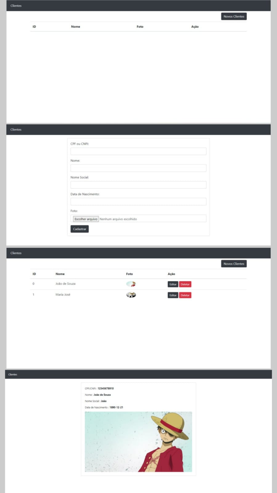

## 📕 About 

Criação de um CRUD (Create, Read, Update and Delete).
 
Informa os clientes cadastrados, com opção para cadastrar novos clientes, editar e deletar os cadastrados.

## ⛏ Tools

- **[PHP 8.2.10](https://www.php.net/releases/8.2/en.php)**
- **[Laravel 10](https://laravel.com/)**
- **[MySQL](https://dev.mysql.com/downloads/installer/)**
- **[Composer](https://getcomposer.org/download/)**
 
#

<h1 align="center">
    
</h1>